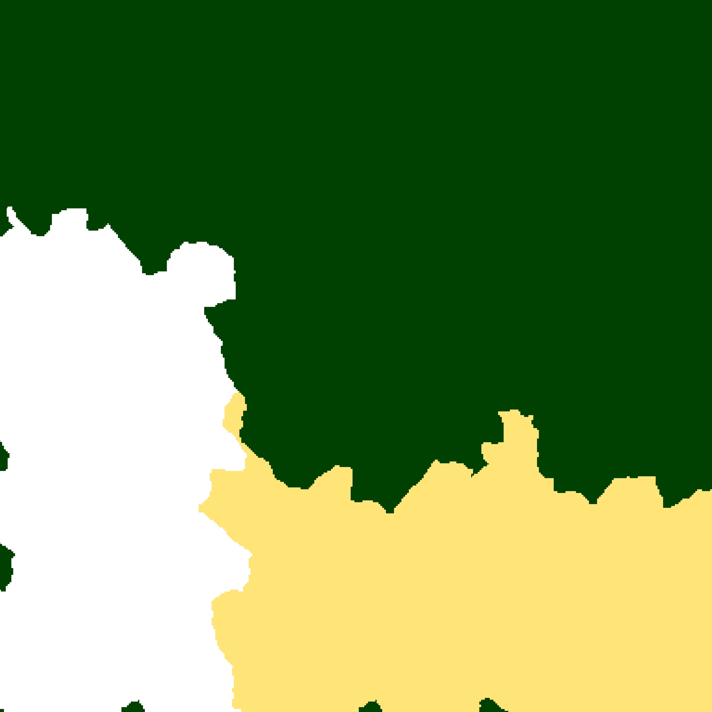

# 7 Days To Die Map Format

This document describes way information is stored in the maps of 7d2d.

## Alpha 21

This chapter describes the map format of the Alpha 21 version of 7d2d. You can find an example map generated with Alpha 21 in the folder "data/Loeceso Valley".

### General Information

#### Map Size

Maps are always square shaped and have a side length of 1024*x meters with the game supporting x values of 2 to 10. Other values might work but problems are to be expected.
The side length will be called mapsize from now on.

#### Coordinate System

The game uses a cartesian coordinate system with meters as a unit and the zero point being in the middle of the map.

### Files

The map consists of a set of different files describing different aspects of the map.

#### biomes.png



This file describes the biomes of the map in a PNG file the size of mapsize times mapsize with a color depth of 24. Every pixel describes the biome of one square meter of the map coded by color using the following mapping.

| Biome       | RGB         |
|-------------|-------------|
| Pine Forest | 0,64,0      |
| Desert      | 255,228,119 |
| Snow        | 255,255,255 |
| Wasteland   | 255,168,0   |

#### dtm.raw


This file describes the Digital Terrain Model (DTM) of the map, i.e. it provides a height map. It does so in the form of a greyscale image in a RAW format the size of mapsize times mapsize. Every pixel describes the altitude of one square meter of the map with black being bedrock and white being the highest reachable point.

Raw image formats are formats used by digital cameras and are therefore specific to the camera manufacturer in question. The raw file extension however suggests that the file is stored in the "raw image data" format as used by Panasonic and Leica.

Luckily the game will turn a dtm.png file into a dtm.raw file by itself so that we can use PNG files for height information.

#### main.ttw

This is a binary file beginning with ttw, containing the build of the game the map was created on and a long integer at the end. The exact content of this file is unclear but no map can be loaded without one. The best approach for now is to use a ttw file created by the game itself for all generated maps.

#### map_info.xml

This file Contains information about the configuration the user entered when creating the map like game version, height map resolution and slider values in an xml file.

```xml
<?xml version="1.0" encoding="UTF-8"?>
<MapInfo>
  <property name="Scale" value="1" />
  <property name="HeightMapSize" value="2048,2048" />
  <property name="Modes" value="Survival,SurvivalSP,SurvivalMP,Creative" />
  <property name="FixedWaterLevel" value="false" />
  <property name="RandomGeneratedWorld" value="true" />
  <property name="GameVersion" value="Alpha.21.0.324" />
  <property name="Generation.Seed" value="7map" />
  <property name="Generation.Towns" value="Default" />
  <property name="Generation.Wilderness" value="Default" />
  <property name="Generation.Lakes" value="Default" />
  <property name="Generation.Rivers" value="Default" />
  <property name="Generation.Cracks" value="Default" />
  <property name="Generation.Craters" value="Default" />
  <property name="Generation.Plains" value="6" />
  <property name="Generation.Hills" value="6" />
  <property name="Generation.Mountains" value="3" />
  <property name="Generation.Snow" value="4" />
  <property name="Generation.Forest" value="7" />
  <property name="Generation.Desert" value="4" />
  <property name="Generation.Wasteland" value="3" />
</MapInfo>
```

#### prefabs.xml

This file describes the POIs on the map in an xml file.

```xml
<?xml version="1.0" encoding="UTF-8"?>
<prefabs>
  <decoration type="model" name="rwg_tile_countryresidential_corner" position="-274,28,476" rotation="3" />
  <decoration type="model" name="xcostum_Split_Level(by_CraterCreator)" position="-274,34,504" rotation="2" />
  <decoration type="model" name="part_driveway_countryresidential_03" position="-246,34,546" rotation="2" />
  <decoration type="model" name="xcostum_Meth_Lab(by_Rifmaz)" position="-222,7,530" rotation="3" />
  <decoration type="model" name="part_driveway_countryresidential_06" position="-223,34,538" rotation="3" />
  <decoration type="model" name="house_old_tudor_06" position="-274,31,556" rotation="0" />
  <decoration type="model" name="part_driveway_countryresidential_09" position="-244,34,555" rotation="0" />
    ...
</prefabs>
```
A POI is defined by its name that serves as a unique identifier and the position in meters along the x, z and y axis. The rotation stores the orientation of the POI in rotation*90 degree clockwise.

#### radiation.png

This file describes the radiation zones on the map in a PNG file of 24 bits color depth. Every pixel describes the radiation status of one square meter of the map with RGB(255,0,0) being radiated and everything else being not radiated.

#### spawnpoints.xml

This file describes the possible locations a player can spawn if they have no bedroll laid out.

```xml
<?xml version="1.0" encoding="UTF-8"?>
<spawnpoints>
    <spawnpoint position="-499,42.41047,-199" rotation="0,327.5886,0"/>
    <spawnpoint position="-499,46.10667,101" rotation="0,343.4552,0"/>
    <spawnpoint position="-499,34.37099,401" rotation="0,312.1248,0"/>
    <spawnpoint position="-349,34.94135,-199" rotation="0,47.63111,0"/>
    <spawnpoint position="-349,38.93728,-49" rotation="0,31.45568,0"/>
    <spawnpoint position="-349,38.8287,101" rotation="0,302.896,0"/>
    <spawnpoint position="-349,34.18877,251" rotation="0,352.9344,0"/>
    <spawnpoint position="-199,37.83615,-49" rotation="0,41.67789,0"/>
    <spawnpoint position="-199,36.5465,101" rotation="0,288.0667,0"/>
    <spawnpoint position="-49,34.48711,-199" rotation="0,189.6957,0"/>
    <spawnpoint position="-49,47.03329,101" rotation="0,62.72899,0"/>
    <spawnpoint position="-49,34.56147,251" rotation="0,167.4234,0"/>
    <spawnpoint position="101,36.58208,-199" rotation="0,352.545,0"/>
    <spawnpoint position="101,58.00309,-49" rotation="0,37.32554,0"/>
    <spawnpoint position="101,60.25307,101" rotation="0,224.4543,0"/>
</spawnpoints>
```

Spawn points describe the position in the map's coordinate system (x, z, y) and the rotation of the player (pitch, yaw, roll) during spawn.

#### splat3.png

This file contains road geometries as a splat map defined as lines in a PNG. The color coding is unclear at the moment.

#### splat4.png

This file contains road geometries as a splat map defined as lines in a PNG. The color coding is unclear at the moment.


